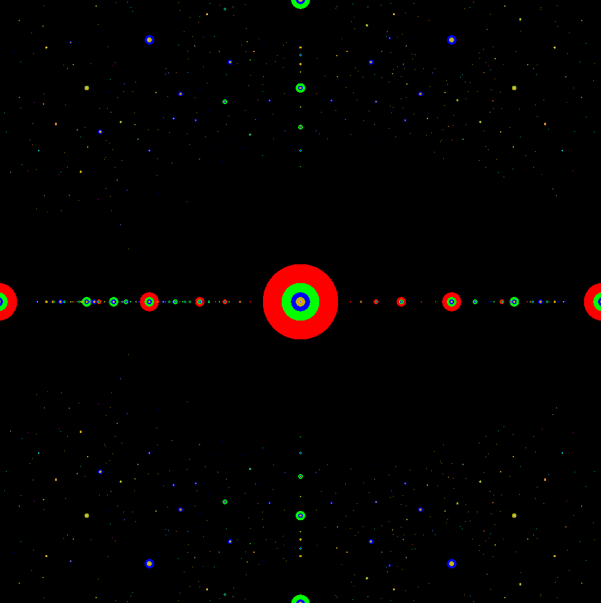

# algebraics-viz

The algebraic numbers are exactly those that are roots of a integer polynomial. They form a subfield of the complex numbers. Since they are dense in R, they are hard to visualize. Recreate this visualization here: // https://commons.wikimedia.org/wiki/File:Algebraicszoom.png

- [x] Implement Newton's method to find the roots of a polynomial
- [x] Find the roots of lots and lots of polynomials (implement "precalc")
- [x] Figure out how to draw a triangle using OpenGL.
- [x] Figure out how to draw one circle using OpenGL.
- [x] Figure out how to draw *many* circles using OpenGL.
- [x] Figure out how to color things.
- [ ] Figure out how to texture things.
- [ ] Do this all in Vulkan

